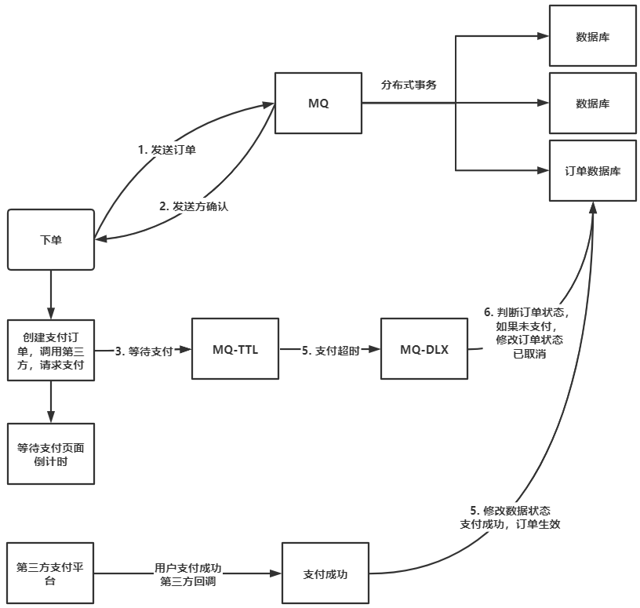
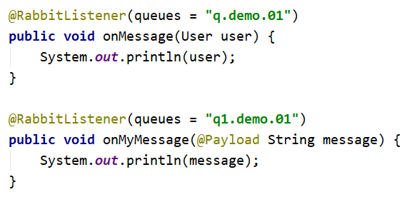
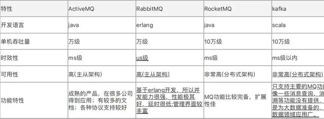
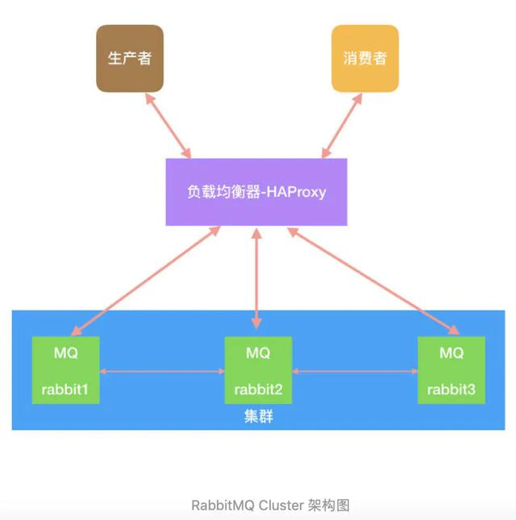
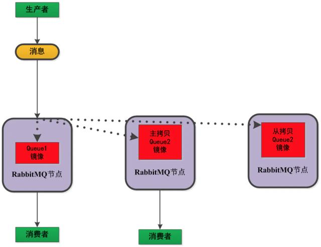
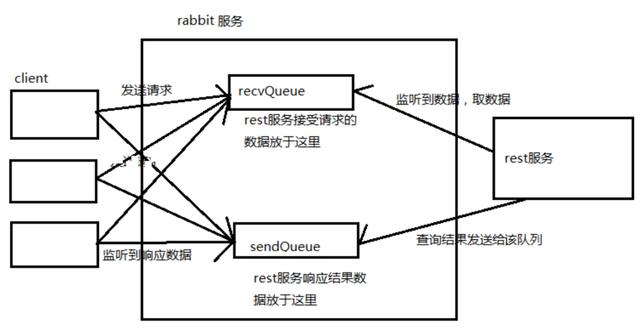
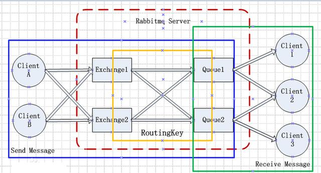

# RabbitMQ直播讲义（讲师：Old Jia）


## 第一部分 内容回顾


## 第二部分 作业讲解

### 1 任务一：消息中间件概述

#### 1.1、消息中间件选型原则包括：（ABCDE）

A、开源

B、流行

C、消息的可靠性

D、横向扩展

E、性能

#### 1.2、RabbitMQ的优缺点不正确的：（E）

A、轻量级、快速部署，使用方便

B、灵活的路由配置

C、支持大多数编程语言

D、大量消息堆积，性能急剧下降

E、RabbitMQ吞吐量比Kafka高

#### 1.3、不是消息中间件使用场景的是：（D）

A、消息的异步处理

B、系统的解耦

C、高并发流量削峰

D、热点数据缓存


### 任务二：RabbitMQ架构与实战

#### 2.1、交换器类型有哪些？（ABD）

A、fanout类型交换器

B、direct类型交换器

C、Handler类型交换器

D、topic类型交换器

#### 2.2、不是RabbitMQ组件的是：（A）

A、生产者、消费者

B、绑定

C、交换器

D、消息队列

#### 2.3、下述命令使用错误的是：（AB）

A、rabbitmqctl enable rabbitmq_management

B、rabbitmqctl set_permission --vhost hello zhangsan ".\*" ".\*" ".\*"

C、rabbitmqctl set_user_tags zhangsan policymaker

D、rabbitmq-plugins --list --enabled

#### 2.4、RabbitMQ的工作模式有哪些？（ABCE）

A、Work Queue

B、Publish/Subscribe

C、Routing

D、Publisher Confirms

E、RPC


### 任务三：RabbitMQ高级特性解析

#### 3.1、如何保证消息可靠性？（ABCDE）

A、异常捕获机制

B、使用消息事务

C、生产者确认机制

D、消费者确认机制

E、持久化存储机制

#### 3.2、关于TTL机制说法不正确的是：（ABD）

A、RabbitMQ支持消息的过期时间，只能给消息指定过期时间

B、java中通过x-message-ttl属性指定消息的过期时间

C、消息队列通过x-expires设置过期时间

D、如果TTL设置为0，则消息永不过期

#### 3.3、消息在什么情况下会变为死信？（ABC）

A、消息过期

B、队列达到最大长度

C、消息被拒绝并设置requeue为false

D、消息被消费

#### 3.4、是延时交换器工作步骤的是：（ABC）

A、生产者将消息和路由键发送到指定的延时交换器上

B、延时交换器存储消息，等待消息到期，根据路由键将消息发送到绑定的队列中

C、队列把消息发送给消费者

D、RabbitMQ中启用自带的延时交换器。


### 任务四：RabbitMQ集群与运维

#### 4.1、关于镜像队列说法正确的是：（ABC）

A、每个镜像队列包含一个master，若干个镜像

B、master存在于称为master的节点上

C、所有的操作都是首先对master执行，然后master将操作广播到镜像

D、镜像队列提供了高可用和负载均衡

#### 4.2、关于HAProxy负载均衡说法正确的是：（AC）

A、HAProxy提供VIP供上游应用直接连接

B、HAProxy用于防止RabbitMQ的单点故障

C、HAProxy支持四层、七层负载均衡。

D、可以使用KeepAlived替换HAProxy做负载均衡。

#### 4.3、下列属于RabbitMQ集群架构的是：（ABC）

A、Warren模式

B、镜像队列模式

C、Federation模式

D、两地三中心


### 任务五：RabbitMQ源码解析

#### 5.1、消息发送流程包括哪些？（ABCD）

A、生产者连接RabbitMQ，建立TCP连接（Connection），声明通道（Channel）

B、声明交换器，设置相关属性

C、声明队列，设置相关属性，并使用绑定键绑定交换器和队列

D、生产者发送消息到RabbitMQ，消息中包含路由键。

#### 5.2、如何推送消息？（ABCD）

A、使用Channel的basicConsume方法，并设置回调用于接收消息

B、等待RabbitMQ Broker 回应并投递相应队列中的消息， 消费者接收消息。

C、消费者确认( ack) 接收到的消息。

D、RabbitMQ 从队列中删除相应己经被确认的消息。

#### 5.3、RabbitMQ启动过程包括：（ABCD）

A、check erlang的版本

B、启动rabbit_sup，并没有启动任何child

C、注册rabbit这个进程

D、构造boot steps有向无环图，并按顺序启动boot steps


### 实操

基于RabbitMQ的TTL以及死信队列，使用SpringBoot实现延迟付款，手动补偿操作。

1、用户下单后展示等待付款页面

2、在页面上点击付款的按钮，如果不超时，则跳转到付款成功页面

3、如果超时，则跳转到用户历史账单中查看因付款超时而取消的订单。


用户首先下单，下单一般是分布式事务。使用MQ，使用发送方确认机制，只要生产者将消息发送到MQ，即可认为消息发送成功，订单创建成功。

只要返回用户消息发送成功，就向延迟队列发送一条消息，用于用户的延迟支付。

延迟队列挂死信队列，消费者消费死信队列消息，对订单状态进行修改。

修改订单状态之前，需要先判断订单的状态，如果订单的状态不是“待支付”，则放弃修改。

只修改订单状态为”待支付“的订单，将其状态修改为”已取消“。


后台开始在数据库创建订单，此时订单的状态为“待支付”。

如果用户在倒计时结束前支付成功，就修改订单状态为“已支付”。

如果用户在倒计时结束，也没有支付，就修改订单状态为“已取消”。


订单消息队列和延迟支付队列是两个队列，一个用于创建订单，另一个用于订单状态的修改。

支付成功事件也用于修改订单状态。


 


```shell
[root@node1 ~]# rabbitmqctl add_vhost delayed_pay
[root@node1 ~]# rabbitmqctl add_user root 123456
[root@node1 ~]# rabbitmqctl set_user_tags root administrator
[root@node1 ~]# rabbitmqctl set_permissions -p delayed_pay root ".*" ".*" ".*"
```


代码见程序文件。


## 第三部分 troubleshooting


### 3.1 老师deliver tag和 correlation id有区别吗


RabbitMQ使用basic.deliver方法向消费者推送消息。

该方法带有一个参数：delivery tag，该tag用于唯一地标记该channel上发送的消息。

Delivery Tag的作用范围就是channel。

delivery tag是单调递增的正整数。客户端确认消息的方法需要delivery tag参数。

由于delivery tag作用范围是channel，因此必须**在同一个channel确认消息**。


publisher-confirms借用了消费者消费消息发送确认消息的方式。

当生产者发送消息到broker，broker发送确认消息，其中包含了delivery tag。


correlation id用在RPC场合。即使用RabbitMQ实现RPC方式的同步调用。

有了correlation id，就避免了发送方每发送一个消息，都需要声明一个临时队列接收响应的消息。


### 3.2 持久化的消息在消费端确认消费后会从borker中删除吗？


对于自动确认，当消息一发送就认为消息已经被成功处理。如果消费者在收到自动确认消息之前宕掉，则消息丢失。

手动确认的选项为：
1. basic.ack：表示消息确认
2. basic.nack：表示消息未确认（RabbitMQ对AMQP协议的扩展，消息可以重新入队）
3. basic.reject：表示消息未确认，但是跟basic.nack有一个区别。

消息确认仅仅是用于告诉RabbitMQ，该消息已经被消费了，可以删除了。

使用basic.reject未确认消息跟basic.ack效果一样。

只不过一个表示成功处理了，一个表示消息不处理，但是结果都导致消息的删除。


### 3.3 NONE模式下的消息，只要mq一发出，就自动从mq中删除（标记为已经消费）吗？


如果指的是springboot中整合RabbitMQ中的publisher-confirm-type的值为none，则none表示不启用publisher-confirms。

```properties
spring.rabbitmq.listener.simple.acknowledge-mode=manual
# publisher-confirms的类型：simple，correlated，none
# none：不启用publisher-confirms
# correlated：使用CorrelationData关联发送的消息和关联的确认信息
# simple：使用RabbitTemplate.waitForConfirms()或者waitForConfirmsOrDie()关联相关操作，确认需要使用发送消息的channel。
spring.rabbitmq.publisher-confirm-type=correlated
# 是否启用publisher-returns
spring.rabbitmq.publisher-returns=true
```


对于消息的确认：


对于自动确认，当消息一发送就认为消息已经被成功处理。如果消费者在收到自动确认消息之前宕掉，则消息丢失。

手动确认的选项为：

1. basic.ack：表示消息确认
2. basic.nack：表示消息未确认（RabbitMQ对AMQP协议的扩展，消息可以重新入队）
3. basic.reject：表示消息未确认，但是跟basic.nack有一个区别。

消息确认仅仅是用于告诉RabbitMQ，该消息已经被消费了，可以删除了。

**使用basic.reject未确认消息跟basic.ack效果一样。**

只不过一个表示成功处理了，一个表示消息不处理，但是结果都导致消息的删除。


### 3.4 mq的queue中存的都是未消费的消息吗？

还有未确认的消息


## 第四部分 消息转换器

`AmqpTemplate`对于需要使用消息转换器的消息发送和接收定义了一些方法。`MessageConverter`对每个数据流向定义了一个方法：将对象转换为Message的方法以及一个将Message转换为对象的方法。

对于将对象转换为Message，一样可以提消息属性。参数`object`对应于消息体。`MessageConverter`接口定义：

```java
public interface MessageConverter {

    Message toMessage(Object object, MessageProperties messageProperties)
     throws MessageConversionException;

    Object fromMessage(Message message) throws MessageConversionException;

}
```

`AmqpTemplate`中消息发送的方法比前面讨论的要简单，因为不需要`Message`对象了。`MessageConverter`将提供的对象转换为字节数组，设置为Message的消息体，然后添加提供的`MessageProperties`，来**创建**每个`Message`。下面是各种方法的定义：

```java
void convertAndSend(Object message) throws AmqpException;

void convertAndSend(String routingKey, Object message)
 throws AmqpException;

void convertAndSend(String exchange, String routingKey, Object message)
 throws AmqpException;

void convertAndSend(Object message, MessagePostProcessor messagePostProcessor)
 throws AmqpException;

void convertAndSend(String routingKey, Object message, MessagePostProcessor messagePostProcessor)
 throws AmqpException;

void convertAndSend(String exchange, String routingKey, Object message,
 MessagePostProcessor messagePostProcessor) throws AmqpException;

```


>`MessageListenerAdapter`也使用`MessageConverter`反序列化消息。


### 4.1 SimpleMessageConverter

`MessageConverter`默认的实现是`SimpleMessageConverter`。负责处理基于文本的内容、序列化的Java对象以及字节数组。

#### 4.1.1 从`Message`转换

如果接收的消息内容类型是文本类型(`contentType=text/plain`)，该类负责检查内容编码属性，以决定将消息体的字节数组转换为字符串的时候使用的编码格式。如果收到的消息中没有设置内容编码属性，则默认使用UTF-8编码格式。

如果要覆盖该默认行为，可以配置一个`SimpleMessageConverter`对象，并设置`defaultCharset`属性，然后注入到`RabbitTemplate`中。


如果接收的消息的内容类型属性设置为`application/x-java-serialized-object`，`SimpleMessageConverter`尝试将字节数组反序列化为java对象。对于简单的清醒还可以，不推荐使用java的序列化机制，因为它将生产者和消费者紧密耦合在一起。当然生产者、消费者也不能是非java的客户端。由于AMQP是火线级别的协议，非常灵活，所以最好不要这么做。

对于其他的内容类型，`SimpleMessageConverter`直接将消息体内容以字节数组形式返回。


#### 4.1.2 转换到Message

当将对象转换为`Message`的时候，`SimpleMessageConverter`也是处理字节数组、字符串以及可序列化的对象。它根据内容类型属性将对象转换为字节数组（对于字节数组的消息体，则不需要转换）。如果要转换的对象不属于其中任意一种，则消息体为`null`值。


### 4.2 SerializerMessageConverter

跟`SimpleMessageConverter`类似，只不过它对于`application/x-java-serialized-object`类型的消息转换设置Spring框架中的`Serializer`和`Deserializer`实现。


### 4.3 Jackson2JsonMessageConverter

#### 4.3.1 转换到Message

如上所述，不推荐基于java序列化机制的序列化方式。

可以使用JSON。

`Jackson2JsonMessageConverter`使用`com.fasterxml.jackson`2.x的库。下面是配置`Jackson2JsonMessageConverter`的示例：

```xml
<bean class="org.springframework.amqp.rabbit.core.RabbitTemplate">
    <property name="connectionFactory" ref="rabbitConnectionFactory"/>
    <property name="messageConverter">
    <bean class= "org.springframework.amqp.support.converter.Jackson2JsonMessageConverter">
    <!-- if necessary, override the DefaultClassMapper -->
    <property name="classMapper" ref="customClassMapper"/>
    </bean>
    </property>
</bean>
```

如上所述，`Jackson2JsonMessageConverter`默认使用`DefaultClassMapper`。类型信息添加到`MessageProperties`中。如果有消息没有在`MessageProperties`中指定消息的类型，而我们又恰好知道，可以使用`defualtType`属性设置静态的类型，对于所有不设置类型信息的消息适用：

```xml
<bean id="jsonConverterWithDefaultType"
 class="o.s.amqp.support.converter.Jackson2JsonMessageConverter">
    <property name="classMapper">
        <bean class="
    org.springframework.amqp.support.converter.DefaultClassMapper">
            <property name="defaultType" value="thing1.PurchaseOrder"/>
        </bean>
    </property>
</bean>
```

另外，也可以自定义映射关系。如下：

```java
@Bean
public Jackson2JsonMessageConverter jsonMessageConverter() {
    Jackson2JsonMessageConverter jsonConverter = new Jackson2JsonMessageConverter();
    jsonConverter.setClassMapper(classMapper());
    return jsonConverter;
}

@Bean
public DefaultClassMapper classMapper() {
    DefaultClassMapper classMapper = new DefaultClassMapper();
    Map<String, Class<?>> idClassMapping = new HashMap<>();
    idClassMapping.put("thing1", Thing1.class);
    idClassMapping.put("thing2", Thing2.class);
    classMapper.setIdClassMapping(idClassMapping);
    return classMapper;
}
```

此时，如果将消息的消息头属性设置为`thing1`，则转换器创建`Thing1`对象。。。


#### 4.3.2 从Message转换

收到的消息需要依照消息头中的类型信息进行转换。该类型信息由发送端指定。

在1.6版本之前，如果没有指定类型信息，转换就失败。从1.6开始，如果没有类型信息，转换器根据`Jackson`的默认值（通常是map）进行转换。

也是从1.6开始，当在方法签名上使用`@RabbitListener`注解的时候，类型信息是添加到`MessageProperties`中的，转换器根据用户设置的参数类型将消息体的字节数组转换为目标类型。适用于只有一个参数并且没有注解或只有一个使用了@Payload注解的参数。`Message`类型的参数在这个过程忽略。




```java
@RabbitListener
public void thing1(Thing1 thing1) {...}
@RabbitListener
public void thing1(@Payload Thing1 thing1, @Header("amqp_consumerQueue") String
queue) {...}
@RabbitListener
public void thing1(Thing1 thing1, o.s.amqp.core.Message message) {...}
@RabbitListener
public void thing1(Thing1 thing1, o.s.messaging.Message<Foo> message) {...}
@RabbitListener
public void thing1(Thing1 thing1, String bar) {...}
@RabbitListener
public void thing1(Thing1 thing1, o.s.messaging.Message<?> message) {...}
```

对于前四种情形，转换器尝试转换为Thing1类型。第五个案例不正确，因为不知道到底哪个参数接收消息内容。第六种方案中，Jackson默认将消息转换为通用类型，因为它是`WildcardType`。


也可以自定义转换器，使用`targetMethod`消息属性决定将JSON转换为哪个类型。


> 类型推断仅适用于在方法级别声明`@RabbitListener`注解。对于类级别声明的`@RabbitListener`，转换的类型用于选择调用哪个添加了`@RabbitHandler`注解的方法。由于这个原因，架构提供了`targetObject`消息属性，可以用于自定义转换器，以决定将JSON转换为哪个类型。


> 从1.6.11版本开始，`Jackson2JsonMessageConverter`以及`DefaultJackson2JavaTypeMapper`(`DefaultClassMapper`)提供了`trustedPackages`选项，用于修补序列化小玩意儿的脆弱性。默认情况下，为了向前兼容，`Jackson2JsonMessageConverter`信任所有的包，即该选项的值为"*"。


## 第五部分 大厂笔试题

### 5.1 上千万条消息在RabbitMQ中积压了几个小时还没解决：

1. 先修复consumer的问题，确保其恢复消费速度，然后将现有consumer都停掉；
2. 新建⼀个topic，partition是原来的10倍，临时建⽴好原先10倍或者20倍的queue数量；
3. 然后写⼀个临时的分发数据的consumer程序，这个程序部署上去消费积压的数据；消费之后不做耗时的处理，直接均匀轮询写⼊临时建⽴好的10倍数量的queue；
4. 接着临时征⽤10倍的机器来部署consumer，每⼀批consumer消费⼀个临时queue的数据；
5. 这种做法相当于是临时将queue资源和consumer资源扩⼤10倍，以正常的10倍速度来消费数据；
6. 等快速消费完积压数据之后，得恢复原先部署架构，重新⽤原先的consumer机器来消费消息。

**总结：**

1. 修复并停掉consumer；
2. 新建⼀个topic，partition是原来的10倍，建⽴临时queue，数量是原来的10倍或20倍；
3. 写临时consumer程序，临时征⽤10倍的机器去消费数据；
4. 消费完成之后，恢复原先consumer；

### 5.2、rabbitmq设置过期时间，部分消息丢失：

采取批量重导⽅法：将丢失的那批数据查询导⼊到mq⾥⾯。

### 5.3、RabbitMQ 上的⼀个 queue 中存放的 message 是否有数量限制？

可以认为是⽆限制，因为限制取决于机器的内存，但是消息过多会导致处理效率的下降。

### 5.4、分布式部署：

RabbitMQ⽆法容忍不同数据中⼼之间⽹络延迟，但是可以通过3种⽅式实现分布式部署：Federation和Shovel。

### 5.5、如何确保消息正确地发送⾄RabbitMQ？

**RabbitMQ使⽤发送⽅确认模式，确保消息正确地发送到RabbitMQ。**

**发送⽅确认模式：**将信道设置成confirm模式（发送⽅确认模式），则所有在信道上发布的消息

都会被指派⼀个唯⼀的ID。⼀旦消息被投递到⽬的队列后，或者消息被写⼊磁盘后（可持久化

的消息），信道会发送⼀个确认给⽣产者（包含消息唯⼀ID）。如果RabbitMQ发⽣内部错误

从⽽导致消息丢失，会发送⼀条nack（not acknowledged，未确认）消息。

> 发送⽅确认模式是异步的，⽣产者应⽤程序在等待确认的同时，可以继续发送消息。当确认消息到达⽣产者应⽤程序，⽣产者应⽤程序的回调⽅法就会被触发来处理确认消息。

### 5.6、如何确保消息接收⽅消费了消息？

**接收⽅消息确认机制：**消费者接收每⼀条消息后都必须进⾏确认（消息接收和消息确认是两个不同操作）。只有消费者确认了消息，RabbitMQ才能安全地把消息从队列中删除。

这⾥并没有⽤到超时机制，RabbitMQ仅通过Consumer的连接中断来确认是否需要重新发送消息。也就是说，只要连接不中断，RabbitMQ给了Consumer⾜够⻓的时间来处理消息。

**特殊情况：**

1. 如果消费者接收到消息，在确认之前断开了连接或取消订阅，RabbitMQ会认为消息没有被分发，然后重新分发给下⼀个订阅的消费者。（可能存在消息重复消费的隐患，需要根据bizId去重）
2. 如果消费者接收到消息却没有确认消息，连接也未断开，则RabbitMQ认为该消费者繁忙，将不会给该消费者分发更多的消息。

### 5.7、如何避免消息重复投递或重复消费？

在消息⽣产时，MQ内部针对每条⽣产者发送的消息⽣成⼀个inner-msg-id，作为去重和幂等的依据（消息投递失败并重传），避免重复的消息进⼊队列；在消息消费时，要求消息体中必须要有⼀个bizId（对于同⼀业务全局唯⼀，如⽀付ID、订单ID、帖⼦ID等）作为去重和幂等的依据，避免同⼀条消息被重复消费。

### 5.8、消息基于什么传输？

由于TCP连接的创建和销毁开销较⼤，且并发数受系统资源限制，会造成性能瓶颈。

RabbitMQ使⽤信道的⽅式来传输数据。信道是建⽴在真实的TCP连接内的虚拟连接，且每条TCP连接上的信道数量没有限制。

1. RabbitMQ采⽤类似NIO（Non-blocking I/O）做法，选择TCP连接复⽤，不仅可以减少性能开销，同时也便于管理。
2. 每个线程把持⼀个信道，所以信道服⽤了Connection的TCP连接。同时RabbitMQ可以确保每个线程的私密性，就像拥有独⽴的连接⼀样。

### 5.9、消息如何分发？

若该队列⾄少有⼀个消费者订阅，消息将以循环（round-robin）的⽅式发送给消费者。每条消息只会分发给⼀个订阅的消费者（前提是消费者能够正常处理消息并进⾏确认）。

### 5.10、消息怎么路由？

**从概念上来说，消息路由必须有三部分：**交换器、路由、绑定。⽣产者把消息发布到交换器上；绑定决定了消息如何从交换器路由到特定的队列；消息最终到达队列，并被消费者接收。

1. 消息发布到交换器时，消息将拥有⼀个路由键（routing key），在消息创建时设定。
2. 通过队列路由键，可以把队列绑定到交换器上。
3. 消息到达交换器后，RabbitMQ会将消息的路由键与队列的路由键进⾏匹配（针对不同的交换器有不同的路由规则）。
4. 如果能够匹配到队列，则消息会投递到相应队列中；如果不能匹配到任何队列，消息将进⼊ “⿊洞”。

### 5.11、如何确保消息不丢失？

> 消息持久化的前提是：将交换器/队列的durable属性设置为true，表示交换器/队列是持久交换器/队列，在服务器崩溃或重启之后不需要重新创建交换器/队列（交换器/队列会⾃动创建）。

**如果消息想要从Rabbit崩溃中恢复，那么消息必须：**

1. 在消息发布前，通过把它的 “投递模式” 选项设置为2（持久）来把消息标记成持久化
2. 将消息发送到持久交换器
3. 消息到达持久队列

> RabbitMQ确保持久性消息能从服务器重启中恢复的⽅式是，将它们写⼊磁盘上的⼀个持久化⽇志⽂件，当发布⼀条持久性消息到持久交换器上时，Rabbit会在消息提交到⽇志⽂件后才发送响应（如果消息路由到了⾮持久队列，它会⾃动从持久化⽇志中移除）。⼀旦消费者从持久队列中消费了⼀条持久化消息，RabbitMQ会在持久化⽇志中把这条消息标记为等待垃圾收集。如果持久化消息在被消费之前RabbitMQ重启，那么Rabbit会⾃动重建交换器和队列（以及绑定），并重播持久化⽇志⽂件中的消息到合适的队列或者交换器上。

### 5.12、使⽤RabbitMQ有什么好处？

1. 应⽤解耦（系统拆分）
2. 异步处理（预约挂号业务处理成功后，异步发送短信、推送消息、⽇志记录等，可以⼤⼤减⼩响应时间）
3. 消息分发
4. **流量削峰：**将请求发送到队列中，短暂的⾼峰期积压是允许的。
5. 消息缓冲

### 5.13、消息队列有什么缺点？

1. **系统可⽤性降低：**消息队列出问题影响业务；
2. **系统复杂性增加：**加⼊消息队列，需要考虑很多⽅⾯的问题，⽐如：⼀致性问题、如何保证消息不被重复消费、如何保证消息可靠性传输等。

### 5.14、MQ如何选型？



 

1. 中⼩型公司⾸选RabbitMQ：管理界⾯简单，⾼并发。
2. ⼤型公司可以选择RocketMQ：更⾼并发，可对rocketmq进⾏定制化开发。
3. ⽇志采集功能，⾸选kafka，专为⼤数据准备。

### 5.15、如何保证消息队列⾼可⽤？

**1. 集群：**



 

- 集群可以扩展消息通信的吞吐量，但是不会备份消息，备份消息要通过镜像队列的⽅式解决。
- 队列存储在单个节点、交换器存储在所有节点。

**2. 镜像队列：**将需要消费的队列变为镜像队列，存在于多个节点，这样就可以实现RabbitMQ

的HA⾼可⽤性。作⽤就是消息实体会主动在镜像节点之间实现同步，⽽不是像普通模式那样，

在consumer消费数据时临时读取。缺点就是，集群内部的同步通讯会占⽤⼤量的⽹络带宽。



 

### 5.16、如何保证消息的顺序性？

1. 通过某种算法，将需要保持先后顺序的消息放到同⼀个消息队列中(kafka中就是partition,rabbitMq中就是queue)。然后只⽤⼀个消费者去消费该队列。
2. 可以在消息体内添加全局有序标识来实现。

### 5.17、使用RabbitMQ增加rest服务吞吐量。



 

### 5.18、RabbitMQ交换器有哪些类型？

- **fanout交换器：**它会把所有发送到该交换器的消息路由到所有与该交换器绑定的队列中；
- **direct交换器：**direct类型的交换器路由规则很简单，它会把消息路由到哪些BindingKey和RoutingKey完全匹配的队列中；
- **topic交换器：**匹配规则⽐direct更灵活。
- **headers交换器：**根据发送消息内容的headers属性进⾏匹配（由于性能很差，不实⽤）

**常⽤的交换器主要分为以下三种：**

- **direct：**如果路由键完全匹配，消息就被投递到相应的队列
- **fanout：**如果交换器收到消息，将会⼴播到所有绑定的队列上
- **topic：**可以使来⾃不同源头的消息能够到达同⼀个队列。 使⽤topic交换器时，可以使⽤通配符，⽐如：“*” 匹配特定位置的任意⽂本， “.” 把路由键分为了⼏部分，“#” 匹配所有规则等。特别注意：发往topic交换器的消息不能随意的设置选择键（routing_key），必须是由"."隔开的⼀系列的标识符组成

### 5.19、RabbitMQ如何保证数据⼀致性？

1. **⽣产者确认机制：**消息持久化后异步回调通知⽣产者，保证消息已经发出去；
2. **消息持久化：**设置消息持久化；
3. **消费者确认机制：**消费者成功消费消息之后，⼿动确认，保证消息已经消费。

### 5.20、RabbitMQ消费者自动扩展数量

**SimpleMessageListenerContainer**可根据RabbitMQ消息堆积情况⾃动扩展消费者数量。

### 5.21、RabbitMQ结构



 

- Broker：简单来说就是消息队列服务器实体。
- Exchange：消息交换机，它指定消息按什么规则，路由到哪个队列。
- Queue：消息队列载体，每个消息都会被投⼊到⼀个或多个队列。
- Binding：绑定，它的作⽤就是把exchange和queue按照路由规则绑定起来。
- Routing Key：路由关键字，exchange根据这个关键字进⾏消息投递。
- vhost：虚拟主机，⼀个broker⾥可以开设多个vhost，⽤作不同⽤户的权限分离。
- producer：消息⽣产者，就是投递消息的程序。
- consumer：消息消费者，就是接受消息的程序。
- channel：消息通道，在客户端的每个连接⾥，可建⽴多个channel，每个channel代表⼀个会话任务。

### 5.22、rabbitmq队列与消费者的关系？

1. ⼀个队列可以绑定多个消费者；
2. 消息默认以循环的⽅式发送给消费者；
3. 消费者收到消息默认⾃动确认，也可以改成⼿动确认。


